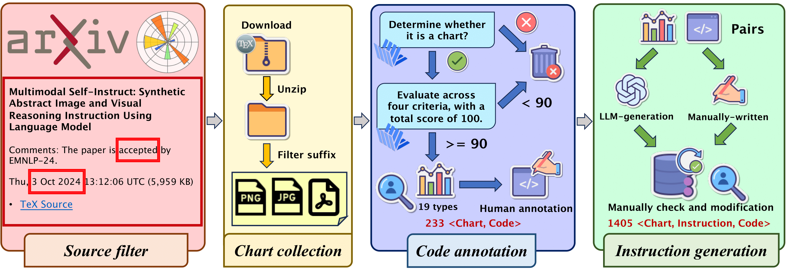

# ChartEdit: How Far Are MLLMs From Automating Chart Analysis? Evaluating MLLMs' Capability via Chart Editing (ACL2025 Findings)

This is the official repo of ChartEdit: How Far Are MLLMs From Automating Chart Analysis? Evaluating MLLMs' Capability via Chart Editing

Here is the main idea of the pipeline for constructing the ChartEdit

We will open the benchmark and code soon.
