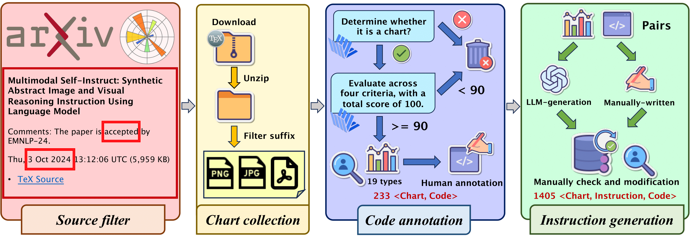
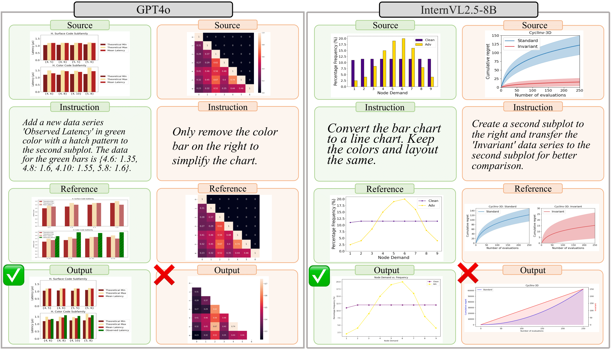

# ChartEdit: How Far Are MLLMs From Automating Chart Analysis? Evaluating MLLMs' Capability via Chart Editing (ACL 2025 Findings)

[](https://huggingface.co/datasets/xxxllz/ChartEdit) [](https://arxiv.org/abs/2505.11935)

This is the official repo of [ChartEdit](https://arxiv.org/abs/2505.11935).

> ChartEdit: How Far Are MLLMs From Automating Chart Analysis? Evaluating MLLMs' Capability via Chart Editing
>
> Xuanle Zhao*, Xuexin Liu*, Haoyue Yang*, Xianzhen Luo, Fanhu Zeng, Jianling Li, Qi Shi†, Chi Chen†

## TODO
- [x] Benchmark data
- [ ] Evaluation code

## Overview
Here is the main pipeline for constructing the ChartEdit. 


## Evaluation
We will open the benchmark and code soon.

## Example
Study cases are shown below. 


## Citation
```
@article{zhao2025chartedit,
  title={ChartEdit: How Far Are MLLMs From Automating Chart Analysis? Evaluating MLLMs' Capability via Chart Editing},
  author={Zhao, Xuanle and Liu, Xuexin and Yang, Haoyue and Luo, Xianzhen and Zeng, Fanhu and Li, Jianling and Shi, Qi and Chen, Chi},
  journal={arXiv preprint arXiv:2505.11935},
  year={2025}
}
```
